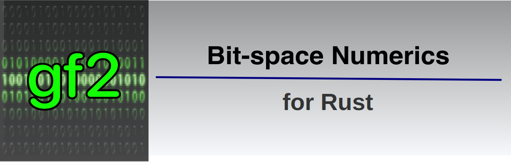

# Project Overview

<p align="center"></p>

`gf2` is a Rust crate for _numerical_ work in _bit-space,_ where mathematical entities such as vectors, matrices, and polynomial coefficients are limited to zeros and ones.

All arithmetic is carried out modulo 2, so what starts in bit-space stays in bit-space. Addition/subtraction becomes the `XOR` operation, and multiplication/division becomes the `AND` operation. The `gf2` library uses those equivalences to efficiently perform most operations by simultaneously operating on entire blocks of elements at a time.

Mathematicians refer to bit-space as [GF(2)][] or $\mathbb{F}_2$. It is the simplest [Galois Field] with just two elements, 0 and 1.

While computer hardware famously operates on bits, computers don't really provide _direct_ access to _single_ bits.

Instead, computers have memory registers for _words_ where the smallest addressable unit is an eight-bit word, a _byte_. Other "native" word lengths vary by computer architecture, but 8, 16, 32, 64, and even 128-bit words are widely supported. Computers perform operations on and between those short word types optimally.

Blocks of zeros and ones are best modelled by the simplest _unsigned integer_ primitive types.
In this library, we pack contiguous bit elements into arrays of one of those unsigned word types

For example, if we have a bit-vector of size 200, and the underlying word is a `u64`, the bit elements will be packed into four words (a total of 256 bits), and there will be 56 bits of unused capacity.
The library will efficiently perform almost all operations on that vector 64 bits at a time in an inherently parallel manner.

## Main Types

This stand-alone crate provides the following principal types:

| Type           | Description                                                                     |
| -------------- | ------------------------------------------------------------------------------- |
| [`BitArray`][] | A fixed-size vector of bits (requires compilation with the `unstable` feature). |
| [`BitVec`][]   | A dynamically-sized vector of bits.                                             |
| [`BitSlice`][] | A vector that is a non-owning view into contiguous ranges of bits.              |
| [`BitPoly`][]  | A polynomial over [GF(2)][].                                                    |
| [`BitMat`][]   | A matrix over [GF(2)][].                                                        |

There are also iterators for vector-like types and algorithms for solving systems of linear equations, decomposing bit matrices, and so on.

The [`BitArray`][], [`BitVec`][], and [`BitSlice`][] types share many methods, and all implement the [`BitStore`][] trait, which provides a rich set of associated methods for manipulating collections of bits. The methods include bit accessors, mutators, fills, queries, stringification methods, bit-wise operators, arithmetic operators, and more. There are also various iterator types for iterating over all bits, set bits, unset bits, and underlying words in any bit-store.

The [`BitPoly`][] type has methods for polynomial arithmetic (addition, multiplication, etc.)
It can also be used to compute $x^N$ modulo any bit-polynomial, where $N$ can be a huge integer.
This is useful for computing large jumps and parallelising simulations for some pseudo-random number generators.

The [`BitMat`][] type supports all the usual interactions between bit-matrices and bit-vectors.
It also includes methods for computing characteristic polynomials, solving linear systems, and more.

> [!NOTE]
> Operations on and between objects in the `gf2` crate are implemented using bitwise operations on whole underlying words at a time.
> This means we never have to worry about overflows or carries as we would with normal integer arithmetic.
> Moreover, these operations are highly optimised in modern CPUs, enabling fast computation even on large bit matrices and bit vectors.

## Example

Here is a simple example of a program that uses `gf2`:

```rust
use gf2::*;
fn main() {
    let m: BitMat = BitMat::random(6, 6);
    let c = m.characteristic_polynomial();
    println!("The matrix m:\n{}", m);
    println!("has the characteristic polynomial: c(x) = {}.", c);
    println!("The polynomial sum c(m):\n{}", c(&m));
}
```

- This program creates a random 6 x 6 bit-matrix `m` where the entries 0 and 1 are equally likely to occur.
- It then extracts the characteristic polynomial $c(x) = c_0 + c_1 x + c_2 x^2 + ... + c_6 x^6$.
- Finally, it verifies that `m` satisfies its characteristic equation, $c(m) = 0$ as expected from the [Cayley-Hamilton] theorem.

Here is the output from one run of the program:

```txt
The matrix m:
│1 0 0 0 1 0│
│0 0 1 1 1 0│
│0 1 1 0 1 0│
│1 0 0 0 1 1│
│0 0 1 1 1 1│
│1 0 0 1 0 1│
has the characteristic polynomial: c(x) = x^3 + x^6.
The polynomial sum c(m):
│0 0 0 0 0 0│
│0 0 0 0 0 0│
│0 0 0 0 0 0│
│0 0 0 0 0 0│
│0 0 0 0 0 0│
│0 0 0 0 0 0│
```

> [!NOTE]
> The `gf2` crate makes it possible to quickly extract the characteristic polynomial for a bit-matrix with millions of elements. This problem chokes a naive implementation that fails to account for the unique nature of arithmetic in GF(2).

## Why Use `gf2`?

There are other bit-vector and even some bit-matrix crates available from the [crate registry](crates.io).

However, the types in those crates are typically designed to collect bits into _sets_ and don't have any numerical methods at all. Neither does the standard library's vector class `Vec`.

On the other hand, several well-known linear algebra libraries, such as [`Eigen`][] in C++ and [`nalgebra`][] in Rust, exist. Those packages efficiently manage all the standard _numeric_ types (floats, doubles, integers, etc.) but do not correctly handle [GF(2)]. You can create matrices of integers whose elements are 0 or 1, but there is no built-in knowledge in those libraries that arithmetic is mod 2.

For example, you might use `Eigen` to create an integer matrix of all 0's and 1's and then use a built-in function from that library to extract the characteristic polynomial. Modding the coefficients of that polynomial by 2 gets the appropriate version for GF(2). Technically, this works, but you will have overflow problems for even relatively modest-sized matrices with just a few hundred rows and columns. Of course, you might use an underlying `BitInt` type that never overflows, but the calculations become dog slow for larger bit-matrices, which doesn't help much.

This specialised `gf2` library is a much better option for numerical problems over [GF(2)]. Consider it if, for example, your interest is in cryptography or random number generation.

## Installation

To include the `gf2` crate in your Rust project, run the following Cargo command in your project directory:

```sh
cargo add gf2
```

The crate has no dependencies beyond the standard library.

## Unstable Features

Some APIs (notably the entire [`BitArray][] type, and the [`BitPoly`][] function-call syntax `p(x)`/`p(M)`) require features that Rust considers "unstable" at the time of writing (though the features have been available for a very long time).

To use those APIs, you can either use stable Rust with the environment variable `RUSTC_BOOTSTRAP` set to `1` or use the nightly Rust compiler.

In either case, you need to enable the features by adding this to your `Cargo.toml`:

```toml
[dependencies.gf2]
features = ["unstable"]
```

or, on the command line, by adding the `--features unstable` flag to `cargo` builds.

If the `unstable` feature is not enabled, the `BitArray` type will not be available, and the `BitPoly` type will not support the function-call syntax `p(x)`/`p(M)`. Instead, you can use the methods `eval_bool`/`eval_matrix` to evaluate polynomials at a bit-vector or bit-matrix argument.

## C++ Version

This Rust crate started life as a _port_ of an equivalent header-only [C++ library][], which has its own [documentation site][].

The port was done _manually_ --- at least for now, LLM's cannot handle this sort of translation task and produce anything that is at all readable or verifiable.

As you might expect with a rewrite, the new version considerably improved on the original. There were two beneficial factors at play:

- We approached the problem anew, and fresh eyes quickly saw several areas for improvement that had nothing to do with the implementation language per se.
- Other improvements came about _because_ we were using a different language with its own idioms, strengths, and weaknesses that forced some new thinking.

The C++ version has been completely rewritten to incorporate those improvements and to backport some of the new ideas from using Rust.

Writing solutions to the same problem in multiple languages has significant benefits, but of course, it is rather expensive and unlikely to find favour in commercial settings.

Perhaps we should repeat the exercise for a third language someday!

For the most part, the two versions are feature equivalent (a few things are not possible in Rust). There are some name changes to accommodate language idioms, for example, the `BitSpan` C++ class is the `BitSlice` type in Rust (C++ uses spans, Rust uses slices), C++ vectors have a `size()` method, Rust vectors have a `len()` method, and so on.

The two versions have very similar performance characteristics, with neither being significantly faster than the other in most scenarios.

## Copyright and License

Copyright (c) 2025-present [Nessan Fitzmaurice][]. <br>
You can use this software under the [MIT License][]

<!-- Reference Links -->

[MIT License]: https://opensource.org/license/mit
[Nessan Fitzmaurice]: mailto:nzznfitz+gh@icloud.com
[GF(2)]: https://en.wikipedia.org/wiki/GF(2)
[Galois Field]: https://en.wikipedia.org/wiki/Galois_field
[`nalgebra`]: https://www.nalgebra.rs/docs/
[`Eigen`]: https://eigen.tuxfamily.org/overview.php?title=Main_Page
[Cayley-Hamilton]: https://en.wikipedia.org/wiki/Cayley%E2%80%93Hamilton_theorem
[C++ library]: https://github.com/nessan/gf2
[documentation site]: https://nessan.github.io/gf2

<!-- Links to docs.rs -->

[`BitStore`]: https://docs.rs/gf2/latest/gf2/store/struct.BitStore.html
[`BitArray`]: https://docs.rs/gf2/latest/gf2/array/struct.BitArray.html
[`BitVec`]: https://docs.rs/gf2/latest/gf2/vec/struct.BitVec.html
[`BitSlice`]: https://docs.rs/gf2/latest/gf2/slice/struct.BitSlice.html
[`BitPoly`]: https://docs.rs/gf2/latest/gf2/poly/struct.BitPoly.html
[`BitMat`]: https://docs.rs/gf2/latest/gf2/mat/struct.BitMat.html
